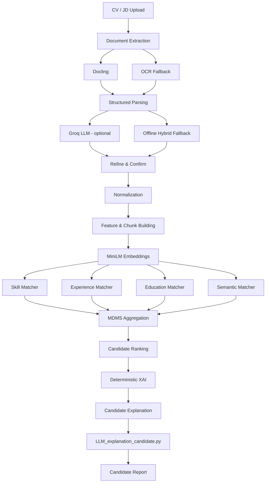

# Intelligent Recruitment Assistant
### Semantic Resume Screening & Job Matching with MDMS and Explainable AI

An end-to-end recruitment-assistance system for parsing CVs and Job Descriptions (JDs), normalizing and representing candidate/job information, ranking candidates with a **Multi-Dimension Matching Score (MDMS)**, and generating evidence-grounded explanations for HR review.

> **Current status:** Local MVP / research prototype.  
> The production runtime path is designed as **Streamlit → FastAPI → NLP/Matching core**.  
> Research experiments are kept separate from runtime artifacts.

---

## 1. Key Features

- Upload and parse **CVs** and **Job Descriptions**
- Supports PDF and image-based documents
- Document extraction with **Docling**, quality checks, and OCR fallback
- Structured CV/JD extraction with **Groq LLM when configured**
- Deterministic offline fallback when Groq is unavailable
- Human **Refine / Confirm** step before downstream matching
- NLP normalization for skills, experience, education, and job requirements
- Local semantic embeddings with `sentence-transformers/all-MiniLM-L6-v2`
- Four-dimension candidate matching:
  - Skill
  - Experience
  - Education
  - Semantic similarity
- Weighted **MDMS** aggregation and candidate ranking
- Evidence-grounded **XAI** layer
- Candidate report / explanation generation with deterministic guardrails
- Development evaluation pipeline with ranking and error metrics
- Research experiments are not part of the released production matcher

---

## 2. System Architecture



### Runtime ownership

```text
Streamlit UI
    ↓
FastAPI
    ↓
Runtime services
    ↓
src/ NLP core
    ↓
Persisted runtime artifacts
```

The frontend does not own scoring truth. Matching, evidence, XAI, and explanations are produced by backend/runtime services.

The Candidate Report uses deterministic MDMS/XAI facts as its trust boundary;
`LLM_explanation_candidate.py` supplies Groq (or offline) narrative wording only.

---

## 3. End-to-End Pipeline

### Stage 1 — Document ingestion

Supported inputs include:

- `.pdf`
- `.png`
- `.jpg`
- `.jpeg`

The document parser first attempts structured extraction using **Docling**. If document quality is insufficient, the pipeline can fall back to OCR.

Typical source-quality statuses include:

```text
ACCEPTED_BY_DOCLING
RECOVERED_BY_OCR
LOW_QUALITY
```

`source_status` describes document/text acquisition, while
`extraction_method` describes structured parsing. `RECOVERED_BY_OCR` with
`groq_llm` is a valid combination.

### Stage 2 — Structured CV/JD extraction

Extracted text is converted into structured JSON.

When `GROQ_API_KEY` is configured:

```text
text
→ Groq structured extraction
→ extraction_method = groq_llm
```

If Groq is unavailable or fails:

```text
text
→ deterministic/offline parser
→ extraction_method = offline_hybrid
```

### Stage 3 — Refine and Confirm

Users may review extracted information before matching.

Confirmed runtime documents become the authoritative downstream input.

```text
Parsed document
→ Refine
→ Confirm
→ Runtime document
```

### Stage 4 — NLP preparation

Confirmed documents are transformed through:

```text
Normalization
→ Feature building
→ Evidence chunking
→ Profile construction
→ Embedding generation
```

The current local embedding model is:

```text
sentence-transformers/all-MiniLM-L6-v2
```

Embeddings are normalized 384-dimensional vectors.

### Stage 5 — Multi-Dimension Matching

The current MDMS architecture evaluates four dimensions:

| Dimension | Description |
|---|---|
| Skill | Match JD skill requirements against candidate skill evidence |
| Experience | Experience years and responsibility-level evidence |
| Education | Degree and field alignment |
| Semantic | Global CV-to-JD semantic alignment |

Current top-level development-selected weights:

```text
Skill      = 0.40
Experience = 0.20
Education  = 0.10
Semantic   = 0.30
```

Conceptually:

```text
MDMS =
    0.40 × S_skill
  + 0.20 × S_experience
  + 0.10 × S_education
  + 0.30 × S_semantic
```

The canonical backend score is on a **0–1 scale**.

For UI display:

```text
score_0_3 = score_0_1 × 3
```

> Missing/unknown components are handled explicitly by runtime semantics.  
> An evaluated `0.0` is not the same as an unavailable (`None`) score.

### Stage 6 — Ranking

Candidates are ranked from persisted MDMS results.

Ranking does **not** recompute matching scores.

### Stage 7 — Explainability

The XAI pipeline converts deterministic matcher evidence into an evidence registry and candidate-level explanation facts.

```text
Matching result
→ xai_v1
→ deterministic pre-explanation
→ guarded narrative generation
→ explanation_v1
```

The explanation layer cannot change:

- MDMS score
- component scores
- weights
- evidence IDs
- missing-skill facts

Groq may be used for wording when configured; deterministic offline explanation remains available.

No vector database is required in this release. Embeddings are computed locally
with MiniLM and compared directly; Pinecone, Milvus, Weaviate, Qdrant, Chroma,
and pgvector are not dependencies.

---

## 4. Tech Stack

### Core

- Python
- FastAPI
- Streamlit
- Pydantic / Pydantic Settings
- NumPy
- Pandas
- Scikit-learn

### NLP / ML

- PyTorch
- Transformers
- Sentence Transformers
- `all-MiniLM-L6-v2`
- Cosine similarity
- Stable production matching uses Skill Matcher V1

### Document Processing

- Docling
- PyMuPDF / PyPDF
- Pillow
- OCR fallback adapters
- OpenCV / EasyOCR / RapidOCR / Tesseract where available

### LLM

- Groq API — optional
- Offline deterministic fallback

### Evaluation

- Recall@K
- nDCG@K
- Spearman correlation
- MAE
- Ablation studies
- Weight sensitivity analysis

---

## 5. Repository Structure

```text
.
├── app/
│   ├── api/                    # FastAPI routers, schemas and runtime services
│   └── frontend/               # Streamlit application
│
├── src/
│   ├── Data_loader/            # Document parsing, OCR and structured extraction
│   ├── Normalization/          # CV/JD normalization
│   ├── Representation/         # Features, chunks and embeddings
│   ├── Matching/               # Skill, Experience, Education, Semantic, MDMS
│   ├── Explainability/         # Evidence-grounded XAI
│   ├── Evaluation/             # Evaluation metrics / ground truth utilities
│   ├── Baselines/              # Baseline systems
│   ├── Optimization/           # Weight search / analysis
│
├── Data/
│   ├── Runtime/                # Runtime web artifacts
│   └── Results/                # Research / evaluation artifacts
│
├── configs/
│   └── mdms.yaml               # Matching/scoring configuration
│
├── scripts/                    # Offline experiment and utility scripts
├── tests/                      # Automated tests
├── docs/                       # Project documentation
├── requirements.txt
├── requirement_dev.txt
└── README.md
```

### Runtime vs Research Data

The project intentionally separates runtime state from research results:

```text
Data/Runtime/
    → active web/runtime artifacts

Data/Results/
    → experiments, metrics, benchmark outputs
```

Do not use `Data/Results` as runtime source-of-truth.

---

## 6. Installation

### 6.1 Clone the repository

```bash
git clone https://github.com/huycuong-2112/Intelligent-Recruitment-Assistant-Semantic-Resume-Screening-and-Job-Matching.git
cd Intelligent-Recruitment-Assistant-Semantic-Resume-Screening-and-Job-Matching
```

### 6.2 Create a virtual environment

#### Windows PowerShell

```powershell
python -m venv .venv
.\.venv\Scripts\Activate.ps1
```

#### macOS / Linux

```bash
python -m venv .venv
source .venv/bin/activate
```

### 6.3 Install project dependencies

```bash
python -m pip install --upgrade pip
pip install -r requirements.txt
```

Optional development dependencies:

```bash
pip install -r requirement_dev.txt
```

### 6.4 Document-parser dependencies

The current parser code uses Docling directly. Production parser dependencies are declared in `requirements.txt`; OCR engines may require additional system packages depending on the document type and operating system:

```bash
pip install -r requirements.txt
```

For PDF OCR through `pdf2image`, Windows users may also need **Poppler** installed and available on `PATH`.

For `pytesseract`, the Tesseract executable and relevant language packs must be installed separately.

> If your branch already pins these packages in `requirements.txt`, do not install them twice manually.

### 6.5 Docker (validated route)

Docker Desktop with Compose is optional:

```bash
docker compose build
docker compose up -d
docker compose ps
```

Open `http://localhost:8501` for the frontend and `http://localhost:8000` for
the backend. Compose supplies the local `.env` to the backend only; it is not
copied into images. Stop with `docker compose down`.

---

## 7. Environment Configuration

Create a local `.env` file in the repository root.

Example:

```env
GROQ_API_KEY=your_groq_api_key_here
```

`GROQ_API_KEY` is optional for the fully local fallback path.

Do **not** commit real API keys.

If no valid Groq key is available, the application should use the offline path where supported.

---

## 8. Run the Application

The local application uses **two processes**.

### Terminal 1 — FastAPI backend

```bash
python -m uvicorn app.api.main:app --host 127.0.0.1 --port 8000
```

Verify:

```text
http://127.0.0.1:8000/
http://127.0.0.1:8000/docs
```

### Terminal 2 — Streamlit frontend

```bash
python -m streamlit run app/frontend/Home.py
```

Open:

```text
http://localhost:8501
```

---

## 9. Typical UI Workflow

```text
1. Open Streamlit
2. Upload one or more CVs
3. Extract CV information
4. Review / Refine
5. Confirm selected CVs
6. Upload a Job Description
7. Extract JD information
8. Review / Refine
9. Confirm JD
10. Run Matching
11. Review candidate ranking
12. Generate / inspect the Candidate Report
```

The system keeps CV and JD runtime identities separate and only matching-ready confirmed documents are consumed downstream.

---

## 10. API Overview

The canonical runtime API is versioned under:

```text
/api/v1
```

Key operations include synchronous parsing, backend-owned asynchronous extraction jobs, confirmation, matching, and explanation:

```text
POST /api/v1/resume/parse
POST /api/v1/resume/parse/async
GET  /api/v1/resume/jobs/{job_id}
POST /api/v1/resume/confirm
POST /api/v1/job/parse
POST /api/v1/job/parse/async
GET  /api/v1/job/jobs/{job_id}
POST /api/v1/job/confirm
POST /api/v1/matching/run
POST /api/v1/explanations/generate
```

When the backend is running, use FastAPI Swagger documentation for the exact current contract:

```text
http://127.0.0.1:8000/docs
```

---

## 11. Running Tests

Run the full regression suite:

```bash
python -m pytest -q
```

Run a specific test file:

```bash
python -m pytest -q tests/<test_file>.py
```

Development tooling is listed in:

```text
requirement_dev.txt
```

---

## 12. Evaluation

The final frozen evaluation uses human-annotated ground truth with one JD and 35 CVs: development 18, blind_v1 6, blind_v2 11, blind_all 17, and full_35 35 (descriptive only). The primary held-out result is `blind_all` (N=17); relevant candidates are defined as `overall >= 2`.

Current evaluation metrics include:

```text
Recall@K
nDCG@K
Spearman correlation
MAE
```

Ground-truth relevance uses a 0–3 ordinal scale.

The current project research separates:

- development experiments
- blind evaluation

Production weights are `mdms_tuned_v1`: Skill 0.40, Experience 0.20,
Education 0.10, Semantic 0.30. Skill V2 is research-only and is not part of
production runtime behavior.

| Metric | Rule-Based | MDMS Equal | MDMS Tuned |
|---|---:|---:|---:|
| Recall@5 | 0.6667 | 1.0000 | 1.0000 |
| Recall@10 | 0.6667 | 1.0000 | 1.0000 |
| Recall@15 | 0.6667 | 1.0000 | 1.0000 |
| nDCG@5 | 0.8772 | 0.9675 | 0.9631 |
| nDCG@10 | 0.8460 | 1.0000 | 1.0000 |
| nDCG@15 | 0.8335 | 0.9394 | 0.9532 |
| Spearman | 0.4124 | 0.5977 | 0.6179 |
| MAE | 0.9565 | 0.7734 | 0.6676 |

Equal and tuned MDMS use the same frozen component scores; only aggregation weights differ. Tuned MDMS is the released configuration. See `docs/evaluation/final_blind_comparison.md`.

---

## 13. Research note

Alternative evidence-retrieval and Cross-Encoder approaches were investigated during development but were not promoted to the stable release. The released system uses Skill Matcher V1.

Current research investigates:

- broader evidence pools
- requirement-level evidence retrieval
- composite requirement decomposition
- MiniLM retrieval
- Alternative retrieval and Cross-Encoder methods were research-only and are not included in production
- hard positive / hard negative benchmark construction

Experimental modules and artifacts must not silently modify production matching behavior.

---

## 14. Current Limitations

- Current MVP is local-only
- Docker/container packaging is validated for the local release route
- No cloud deployment is provided yet
- Current MDMS weights were selected on development data
- Final blind evaluation is project-level evidence, not production-scale validation
- Skill Matcher V2 research remains outside this release
- Some OCR paths depend on external/system packages
- Semantic/evidence redundancy remains an active research question
- Education related-field taxonomy remains an active research question
- Groq provider availability and latency may vary; offline fallback remains available

---

## 15. Design Principles

This project follows several important constraints:

1. **Server-authoritative runtime state**  
   The frontend does not provide scores or evidence truth.

2. **No silent missing-value coercion**  
   `None`, `0.0`, and `NOT_APPLICABLE` have different meanings.

3. **Runtime / research separation**  
   Runtime web state is isolated from experiment artifacts.

4. **Evidence-grounded explainability**  
   Natural-language explanations cannot change deterministic scores or evidence identity.

5. **Reproducible experiments**  
   Production V1 is frozen while experimental versions are evaluated separately.

---

## 16. Security Notes

- Never commit `.env`
- Never commit `GROQ_API_KEY`
- API keys must remain backend-only
- Frontend requests must not contain secrets
- Runtime artifacts should not be treated as public benchmark data by default

---

## 17. Project Status

```text
Local MVP                 : Active
Streamlit UI              : Active
FastAPI backend           : Active
CV/JD extraction          : Active
Runtime confirmation      : Active
Normalization/embeddings  : Active
MDMS matching             : Active
Candidate ranking         : Active
XAI / candidate report    : Active
Skill Matcher V2 research : Not included in production release
Docker / cloud deployment : Not implemented
```

---

## 18. Contributors

Add team members here:

```text
- <Name> — <Role / responsibility>
- <Name> — <Role / responsibility>
- <Name> — <Role / responsibility>
```

---

## 19. License

No license has been specified yet.

If the project will be published for reuse, add a `LICENSE` file and update this section.

---

## Citation / Academic Note

This repository is an academic/research prototype for intelligent recruitment assistance.  
The system is intended to support — not replace — human hiring decisions.
